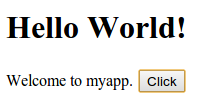
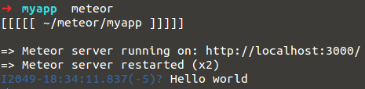
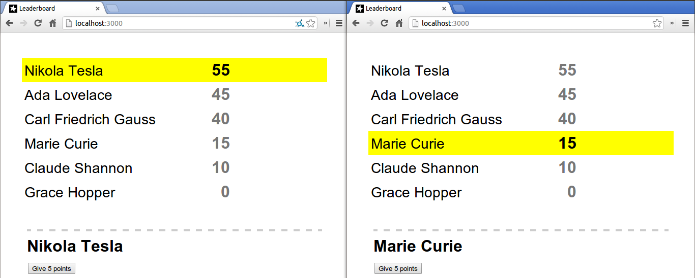

# Installation et prise en main

## Installation

Comme nous l'avons vu au chapitre précédent, Meteor est basé sur Node.js et utilise MongoDB comme base de données. Néanmoins, vous n'avez pas besoin d'installer ces deux dépendances, les bonnes versions de celles-ci sont automatiquement téléchargées dans un répertoire interne à Meteor qui ne vient pas polluer votre environnement.

L'installation de Meteor diffère selon que vous travailliez sous Linux/MacOS ou sous Windows.

### Linux et MacOS

Pour Linux et MacOS, l'installation la plus simple consiste à exécuter la commande suivante dans la console :

```bash
$ curl https://install.meteor.com | /bin/sh
```

Meteor installe tous ses fichiers dans le répertoire `~/.meteor/`, et ajoute un unique script exécutable situé ici : `/usr/local/bin/meteor`.

>  Pour supprimer Meteor de votre ordinateur, il vous faut donc supprimer ces deux éléments :
>
> ```bash
> $ rm -rf ~/.meteor/
> $ sudo rm /usr/local/bin/meteor
> ```

### Windows

Si Windows n'est pas (encore) supporté officiellement, il existe un très bon portage maintenu par un membre de la communauté Meteor. Vous pouvez télécharger l’utilitaire d'installation sur le site du projet : <http://win.meteor.com>. Choisissez « Latest Meteor for Windows (exe bootstrapper) », puis installez l'application sur votre ordinateur.

> Désinstaller Meteor se fera alors comme pour un programme classique dans le panneau de configuration, rubrique « Désinstaller les programmes ».

### L'invite de commandes

Lors de l'installation, vous avez téléchargé un utilitaire `meteor`. Cet utilitaire s'utilise dans l'invite de commandes (parfois appelée *ligne de commande*, *terminal* ou *shell*) et permet par exemple de créer une nouvelle application Meteor, de démarrer un serveur local, d'exécuter des tests, etc.

*Comment ouvrir l'invite de commandes ?*

| Plateforme | Méthode  |
| -- | -- |
| Windows | Menu Démarrer > Exécuter. Écrire `cmd.exe` et valider |
| MacOS | Ouvrir l'application « Terminal » située dans Utilitaires > Applications |
| Linux |  Votre distribution propose probablement une application « Terminal » <br> Sous *Ubuntu*, vous pouvez utiliser le raccourci `CTRL` + `ALT` + `T` |

Vous pouvez d’ores et déjà exécuter la commande `meteor --version` pour vérifier que l'installation s'est bien passée. À l'heure où j'écris ces lignes, Meteor est en version `1.0.0`.

## Créons notre première application

Maintenant que Meteor est installé, nous pouvons créer notre première application. Pour ce faire, exécutez les commandes suivantes :

```bash
$ cd /tmp/
$ meteor create myapp
```

où `myapp` est le nom que vous avez choisi de donner à votre application. Meteor crée alors un répertoire « myapp » dans lequel vous pouvez vous déplacer et lancer l'application qui s'y trouve :

```bash
$ cd myapp
$ meteor run
```

> Si aucune action n'est spécifiée, l'action par défaut est `run`, vous pouvez donc écrire indifféremment `meteor run` ou plus simplement `meteor` pour démarrer l'application Meteor située dans le répertoire courant.

Cette commande lance un serveur local pour le développement. Vous pouvez vous y connecter à l'adresse <http://localhost:3000> dans votre navigateur. Vous devriez alors voir apparaître l'application « Hello world » créée par défaut :



Cette application est composée de trois fichiers : `myapp.css`, `myapp.html` et `myapp.js`.

Laissons de côté les fichiers HTML et CSS et concentrons-nous sur le fichier JavaScript. Remplacez tout le contenu de ce fichier par la ligne de code suivante :

```javascript
console.log("Hello world");
```

<http://meteorpad.com/pad/q8KwqjiieqAHNuXdu>

Ce code se contente simplement d'afficher le texte `Hello world` dans la console.

*Comment ouvrir la console du navigateur ?*

| Navigateur | Méthode  |
| -- | -- |
| Firefox | `F12` <br> ou via le menu Développement web > Console Web |
| Google Chrome | `CTRL` + `SHIFT` + `J` <br> ou via le menu Outils > Console JavaScript |
| Internet Explorer |  `F12` <br> ou via le menu Outils > Outils de développement |


Vous avez peut-être remarqué que le texte « Hello world » s'affiche également dans la console du serveur (c'est-à-dire dans l'invite de commandes où vous avez lancé l'utilitaire `meteor`). Autrement dit, par défaut, le fichier `myapp.js` est exécuté à la fois sur le client et sur le serveur, ceci notamment grâce à l'utilisation du même langage dans les deux environnements.



Évidemment, il est parfois nécessaire de restreindre l’exécution d'une portion de code au serveur ou au client uniquement. Les variables booléennes `Meteor.isClient` et `Meteor.isServer` vous le permettent :

```javascript
// Exécuté à la fois sur le client et sur le serveur
console.log("Hello world");

if (Meteor.isClient) {
  console.log("I'm the client");
}

if (Meteor.isServer) {
  console.log("I'm the server");
}
```

<http://meteorpad.com/pad/Np6JBkWnYHM8vHqaY>

> Vous avez probablement remarqué que l'application est automatiquement rechargée à chaque modification du code source. Cette fonctionnalité s'appelle le *Hot Code Push* et vous évite d'avoir à appuyer sur le bouton « Recharger la page » du navigateur pendant le développement de votre application.
> En fait, la page du navigateur n'est même pas rechargée. Au lieu de cela, le nouveau code est injecté dans la page courante sans interrompre la navigation d'un utilisateur connecté. Ce mécanisme peut également être utilisé en production pour le déploiement pendant que des utilisateurs sont connectés à l'application. Nous l'étudierons plus en détail dans le chapitre 4 consacré au déploiement.

Nous n'avons plus besoin de l'application `myapp` que nous venons de créer. Pour arrêter le serveur, utilisez le raccourci `CTRL` + `C` dans l'invite de commandes. Vous pouvez ensuite supprimer le répertoire `myapp` contenant l'ensemble des fichiers utilisés par l'application. Une fois ce répertoire supprimé, il ne restera plus aucune trace de l'application sur votre ordinateur.

En plus de l'utilitaire en ligne de commande que nous avons utilisé pour créer notre application, Meteor propose des exemples d'applications que nous allons découvrir, comprendre et enrichir de quelques fonctionnalités au fil de ce cours. Pour garder votre arborescence organisée, il est préférable de placer toutes ces applications dans un même répertoire de travail, par exemple sous Linux ou MacOS :

```sh
$ mkdir ~/meteor-apps/
$ cd ~/meteor-apps/
```

## Présentation du leaderboard

On commence avec l'application *leaderboard* fournie avec Meteor. Pour la récupérer dans votre répertoire de travail, utilisez `meteor create --example leaderboard`, puis démarrez l'application `cd leaderboard && meteor` et ouvrez <http://localhost:3000> dans votre navigateur favori.

L'interface utilisateur est constituée d'une liste de scientifiques triée par score. Cliquez sur un scientifique pour le sélectionner, puis cliquez sur « Give 5 points » pour augmenter le score de ce scientifique. Une application somme toute assez simple que nous pourrions aussi bien développer sans Meteor.

Ouvrez maintenant l'application dans une seconde fenêtre de navigateur de manière à garder la première instance visible. Attribuez généreusement quelques points supplémentaires à un scientifique, la seconde vue est automatiquement mise à jour ! Inversement, si vous donnez des points dans la seconde fenêtre, la première est mise à jour. Autrement dit, la modification locale est envoyée au serveur qui la renvoie à tous les clients connectés. En revanche, le scientifique sélectionné (surligné en jaune) est un état local du client, les deux utilisateurs peuvent donc sélectionner deux scientifiques différents simultanément.



> Si votre ordinateur est connecté à un réseau local, vous pouvez aussi vous connecter depuis un autre poste du réseau http://ip-locale-de-votre-ordinateur:3000. L'IP locale peut-être récupérée avec un `ifconfig` (ou `ipconfig` pour Windows) dans l'invite de commandes.

Au cours des prochains chapitres, nous allons étudier le fonctionnement de cette application en abordant les notions de `Template`, de `Session` et de `Collection`. Trois objets essentiels que vous utiliserez ensuite dans chacune de vos applications Meteor !

Mais avant d'entrer dans le vif du sujet, je vous propose de survoler le code source de l'application leaderboard. Comme tout à l'heure, nous disposons de trois fichiers :

* un fichier **css** qui se contente de définir quelques styles pour les éléments de l'interface utilisateur. Ce fichier ne contient aucune ligne de code spécifique à Meteor ;
* un fichier **html** qui contient du HTML entremêlé avec des balises `<template name="something">` et des blocs entre doubles accolades `{{name}}`. Nous étudierons ce langage de template au prochain chapitre ;
* un fichier **js** composé de deux blocs principaux : un bloc à l’intérieur de la condition `if (Meteor.isClient)` qui s’exécute seulement sur le client, et une condition `if (Meteor.isServer)` qui s’exécute seulement sur le serveur, comme nous l'avons vu précédemment. Ce fichier comporte moins de 50 lignes de code.

> Notez qu'il est évidemment possible de séparer le code source de votre application entre plusieurs fichiers HTML, CSS et JavaScript. Un chapitre *excursus* est consacré à l'organisation du code plus tard dans ce cours.

---

Quelle commande utilise-t-on pour créer une nouvelle application Meteor ?
- ( ) `meteor new`
- (x) `meteor create`
- ( ) `meteor run`

Quelle condition utiliser pour exécuter du code sur le serveur uniquement ?
- ( ) `if (server)`
- ( ) `if (Meteor.is_server)`
- (x) `if (Meteor.isServer)`

> Toutes les fonctions fournies par Meteor suivent la convention de nommage CamelCase.

Qu'est que le *Hot Code Push* ?
- ( ) Un moyen de pousser le code le plus important en premier.
- (x) Un moyen pour envoyer les mises à jour aux clients connectés.
- ( ) Un moyen d'éviter de définir quels fichiers doivent être envoyés aux clients.

> Nous avons vu le Hot Code Push à l'œuvre lorsque nous n'avons pas eu à recharger notre page pour y voir les modifications apportées.

---
