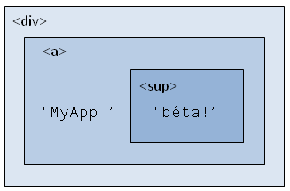
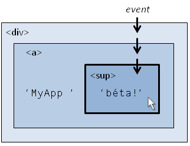
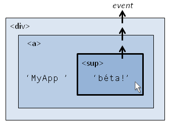
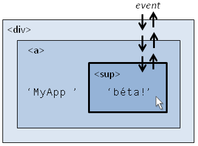
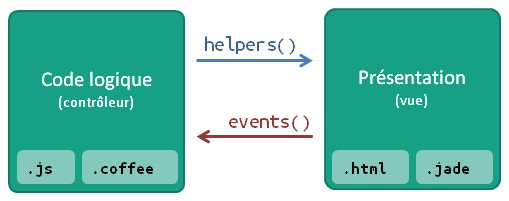

# Les Templates

Comme la plupart des frameworks web, Meteor propose un système de templates (ou vues), afin de séparer le code JavaScript (la logique applicative), du code HTML (la présentation). Mais avec Meteor, cette séparation n'est pas uniquement motivée par un souci d'organisation du code. Les templates sont en effet compilés vers une structure abstraite basée sur JavaScript et envoyée au client. Cette structure est utilisée pour mettre à jour l'interface utilisateur en temps réel à chaque fois que l'utilisateur modifie les données localement ou que le serveur lui envoie les modifications d'autres utilisateurs. Elle est nécessaire pour gérer la réactivité d'une application mais son écriture étant peu commode, on préfère utiliser un langage de template spécifiquement conçu pour ce besoin.

Il existe plusieurs langages de template, c'est-à-dire plusieurs syntaxes dont il existe un compilateur capable de construire la structure abstraite envoyée au client. Ce chapitre présente la syntaxe de **Spacebars**, le système par défaut, mais la plupart des concepts présentés ici sont applicables également aux autres syntaxes.

## Présentation de Spacebars

### Syntaxe générale

Spacebars est simplement du HTML enrichi de quelques expressions qui lui sont spécifiques :

```html
<div class="player {{selected}}">
  <span class="name">{{ name }}</span>
  <span class="score">{{ score }}</span>
</div>
```

Les expressions notées `{{...}}` signifient dans Meteor : « affiche quelque chose ». Il peut s'agir d'un attribut de l'objet courant (ici les attributs `name` et `score` du joueur courant) ou d'une variable définie dans un *template helper* éponyme (ici la classe `selected`). Nous verrons comment définir des template helpers au paragraphe suivant. L'insertion d'un ou de plusieurs espaces blancs entre les accolades et le label est autorisé. Les accolades `{{` et `}}` sont parfois appelées des moustaches.

Il est également possible de définir des expressions dans les attributs d'une balise :

```html
<div data-{{foo}}={{bar}}>
</div>
```

Un template est défini entre les balises `<template name="tplName">` et `</template>`. L'attribut `name` est obligatoire.

> L'organisme en charge de définir les standards du web, le W3C, travaille actuellement sur une balise `<template>`. Il ne faut pas confondre cette balise HTML avec ce que nous utilisons ici. Avec Meteor, les balises templates n'apparaissent jamais dans le DOM, elles ont juste pour rôle de définir un bloc de contenu HTML avec lequel il sera possible d’interagir dans le code JavaScript.

Il peut être nécessaire d'inclure un template à l’intérieur d'un autre template. Pour inclure le template nommé `tplName`, on utilise une *inclusion* qui se note `{{> tplName}}`. L'application leaderboard utilise par exemple une inclusion du template `leaderboard` à l’intérieur d'un `div` défini dans le `<body>` :

```html
<body>
  <div id="outer">
    {{> leaderboard}}
  </div>
</body>
```

Il existe deux templates spéciaux, définis respectivement entre les balises `<head></head>` et `<body></body>`. Ces templates sont automatiquement affichés dans le code HTML de la page, sans qu'il soit nécessaire de demander une inclusion. `<body>` est donc un template parent dans lequel vous pouvez inclure les autres templates de votre application :

```html
<body>
  <header>
    {{> navBar}}
  </header>

  {{> content}}

  <footer>
    {{> footerLinks}}
  </footer>
</body>
```

Les templates contiennent enfin des blocs logiques comme `{{#if}}...{{/if}}` ou encore `{{#each}}...{{/each}}` qui sont des balises doubles qui permettent de contrôler le flux de données. Nous les étudierons plus loin dans ce chapitre, mais leur fonctionnement devrait vous paraître relativement intuitif.

### Commentaires

La syntaxe `{{! Mon commentaire }}` permet d'écrire des commentaires, éventuellement sur plusieurs lignes. Ces commentaires sont retirés par le compilateur et ne sont donc jamais envoyés au client.

Si vous souhaitez écrire un commentaire contenant les caractères `}}` sans mettre fin au commentaire, vous devrez utiliser la syntaxe longue : `{{!-- Cuir Cuir Cuir {{moustache}} --}}`.

Si vous souhaitez que votre commentaire soit envoyé au client et apparaisse dans le DOM, il vous suffit d'utiliser la syntaxe normale en HTML :

```html
<!-- Mon commentaire, visible dans le DOM grace aux outils de debogage -->
```

### Les templates de l'application leaderboard

```html
<head>
  <title>Leaderboard</title>
  <meta name="viewport" content="width=device-width, user-scalable=no">
</head>

<body>
  <div id="outer">
    {{> leaderboard}}
  </div>
</body>

<template name="leaderboard">
  <div class="leaderboard">
    {{#each players}}
      {{> player}}
    {{/each}}
  </div>

  {{#if selected_name}}
  <div class="details">
    <div class="name">{{selected_name}}</div>
    <input type="button" class="inc" value="Give 5 points" />
  </div>
  {{else}}
  <div class="none">Click a player to select</div>
  {{/if}}
</template>

<template name="player">
  <div class="player {{selected}}">
    <span class="name">{{name}}</span>
    <span class="score">{{score}}</span>
  </div>
</template>
```

Comme nous l'avons vu précédemment, tous les templates de l'application leaderboard sont déclarés dans le fichier `leaderboard.html`. On y définit tout d'abord un `<div>` avec l'identifiant `"outer"` dans lequel on demande de rendre le template `leaderboard`.

Le template `leaderboard` commence par demander pour chaque joueur le rendu du template `player`. Celui-ci se contente d'afficher le nom et le score du joueur courant ainsi qu'une classe spécifique si celui-ci est sélectionné. Enfin, si un joueur est sélectionné, le template `leaderboard` affiche le formulaire pour lui donner 5 points, sinon on affiche une indication invitant à sélectionner un joueur.

Ce template utilise le bloc `{{#each players}}` où la variable `players` est une liste de joueurs, et le bloc `{{#if selected_name}}` où `selected_name` est un booléen. Mais rien n'est magique, il faut que quelqu'un fasse le lien entre ces symboles définis dans le template et les objets JavaScript présents en mémoire. C'est précisément le rôle d'un *template helper*.

## Les templates helpers

### Écrire un template helper

Procédons à notre première modification de l'application leaderboard. Pour l'instant, l'incrément de score est codé en dur dans le code JavaScript à la ligne `25`, et dans le template HTML à la ligne `22`. Nous allons stocker cette valeur dans une variable et la transmettre au template via un template helper. Commençons par la définir :

```javascript
var scoreIncrement = 5;
```

Cette variable étant uniquement utilisée chez le client, on peut donc la définir juste après le `if (Meteor.isClient) {`, à la ligne 6.

Puis, dans la requête de mise à jour du score (dont nous étudierons le fonctionnement dans un prochain chapitre), on remplace simplement la valeur `5` par notre nouvelle variable :

```javascript
Players.update(Session.get("selected_player"), {$inc: {score: scoreIncrement}});
```

Dans le template maintenant, on remplace l'expression `Give 5 points` par `Give {{scoreIncrement}} points`. Reste enfin à faire le lien entre ce symbole et notre variable via un *template helper* :

```javascript
Template.leaderboard.helpers({
  players: function() { ... },
  selected_name: function() { ... },
  scoreIncrement: scoreIncrement
});
```

Dans le code ci-dessus, `Template` est l'objet global pour accéder aux templates, et `leaderboard` est le nom du template pour lequel nous souhaitons définir un helper. On utilise pour ce faire la méthode `helpers` de notre template. Cette méthode accepte un unique paramètre, qui est un dictionnaire des symboles associés à leur valeur. Ici on associe le symbole `scoreIncrement` utilisé par le template à la valeur de la variable que nous avons définie plus haut.

> Nous pourrions tout aussi bien écrire une fonction constante, ce qui dans le cas présent est strictement équivalent. Nous verrons l’intérêt d'englober les helpers dans des fonctions lors du chapitre sur la réactivité.
>
> ```javascript
> Template.leaderboard.helpers({
>   scoreIncrement: function() {
>     return scoreIncrement;
>   }
> });
> ```

Sauvegardez les deux fichiers modifiés, puis rendez-vous dans le navigateur pour vérifier que l'application fonctionne toujours comme avant. Puis modifiez la variable `scoreIncrement` pour lui donner une autre valeur. Le bouton de l'interface doit être mis à jour et correspondre à la valeur de l'incrément que vous venez d'entrer.

Notez que vous pouvez appeler la méthode `helpers` plusieurs fois pour le même template, les helpers nouvellement définis s'ajouteront simplement à ceux qui l'ont été précédemment.


## Les blocs logiques

Malgré la séparation du code logique et de sa présentation, il est souvent utile d'utiliser conditions, boucles et autres structures de contrôle du flux directement dans un template.

### Conditions

Le premier bloc disponible est le bloc `{{#if condition}} ... {{/if}}`, où `condition` est défini dans un *template helper* et est évalué comme un booléen.

Si nécessaire, vous pouvez définir un bloc `else` :

```html
{{#if condition}} ... {{else}} ... {{/if}}
```

Le bloc `{{#unless condition}}` fonctionne comme `if` mais inverse la valeur booléenne de la condition, autrement dit le bloc est affiché si la condition n'est pas vérifiée.

> Rappelons au passage la liste des valeurs qui sont évaluées fausses en JavaScript :
>
> * `false`
> * `null`
> * `undefined`
> * La chaîne vide `""`
> * Le nombre `0`
> * Le nombre `NaN`
>
> Il s'agit d'une liste exclusive, toutes les autres valeurs sont évaluées comme vraies dans une condition en JavaScript. En plus de ces valeurs, le tableau vide `[]` sera aussi évalué comme faux dans un template, ce qui est le comportement désiré.

### Notation pointée et `with`

Jusqu'à présent, nos templates helpers retournaient de simples chaînes de caractères, mais il est tout à fait possible de retourner un objet JSON :

```javascript
Template.player_infos.helpers({
  player: {
    name: 'Max',
    score: 20
  }
});
```
Le template devra alors utiliser la notation pointée pour accéder aux attributs de l'objet `player`.

```html
<template name="player_infos">
  {{player.name}} - {{player.score}}
</template>
```

Il est assez courant d'afficher plusieurs propriétés d'un même objet. Le bloc `{{#with objectname}}` permet d'éviter de se répéter. En gardant le même template helper, le template `player_infos` pourra ainsi se réécrire :

```html
<template name="player_infos">
	{{#with player}}
		{{name}} - {{score}}
	{{/with}}
</template>
```

Comme pour le bloc `if`, il est possible de définir une condition `{{else}}` qui sera affichée si l'objet donné à `with` est faux :

```html
<template name="player_infos">
  {{#with player}}
    {{name}} - {{score}}
  {{else}}
    Unknow player
  {{/with}}
</template>
```
### Boucles

Le bloc `each` reçoit une liste d'objets JavaScript. À l’intérieur du bloc, l'objet est attaché au contexte de la même manière que pour le bloc `with`. Ainsi, si les éléments de la liste sont des objets JavaScript, vous aurez directement accès aux attributs de ces objets :

```javascript
Template.player_infos.helpers({
  players: [
    { name: 'Max', score: 20 },
    { name: 'Elo', score: 17 },
    { name: 'Pil', score: 13 }
  ]
});
```

```html
<template name="player_infos">
	{{#each players}}
		{{name}} - {{score}} <br />
	{{/each}}
</template>
```

Dans le cas où les éléments de la liste fournie au bloc `each` sont des variables simples (par exemple des chaînes de caractères), vous pouvez utiliser le symbole `{{this}}` pour les afficher dans le template :

```javascript
Template.calendar.helpers({
  days: ["Lun", "Mar", "Mer", "Jeu", "Ven", "Sam", "Dim"]
});
```

```html
<template name="calendar">
  <ul>
  {{#each days}}
    <li>{{this}}</li>
  {{/each}}
  </ul>
</template>
```

À l'intérieur du bloc `{{#each}}`, le symbole `{{@index}}` indique le numéro d'index de l'itération courante. L'index de la première ligne est `0` :

```html
<template name="calendar">
  <ul>
  {{#each days}}
    <li>{{@index}}. {{this}}</li>
  {{/each}}
  </ul>
</template>
```

Le bloc `each` accepte aussi comme paramètre les curseurs retournés par une requête de la base de données. C'est cette fonctionnalité qui est utilisée dans l'application leaderboard pour lister les joueurs. Nous étudierons les curseurs dans le chapitre consacré aux collections.

Enfin, il est possible de définir un bloc `{{else}}` qui sera affiché si la boucle ne contient aucun élément :

```html
{{#each player}}
  {{> player}}
{{else}}
  No players.
{{/each}}
```

### Blocs personnalisés

Meteor propose un certain nombre de blocs logiques par défaut, mais il est tout à fait possible de définir vos propres blocs logiques. Nous étudierons leur création dans le chapitre « Blaze » de la partie « Notions avancées ».

## Les événements

Un événement est une action de l'utilisateur - ou du code client - qui va pouvoir donner lieu à une interactivité. Les événements les plus courants sont le clic, le survol d'une zone ou la validation d'un formulaire.

Meteor ne révolutionne pas la gestion des événements, et un développeur habitué à utiliser jQuery ne devrait pas être dépaysé outre mesure. La seule spécificité de Meteor concerne l’interfaçage des événements avec les objets `Template`, qu'il faut donc utiliser d'une manière similaire à la définition des templates helpers. Mais avant de voir comment écrire un événement dans une application Meteor, je vous propose quelques explications générales sur la gestion des événements dans un navigateur.

### Capture, bouillonnement et délégation d’événement

Supposons que nous ayons cette structure HTML :

```html
<div>
  <a href="/">
    MyApp <sup>béta!</sup>
  </a>
</div>
```

On peut représenter ce code par une arborescence de blocs imbriqués les uns dans les autres :



Si on définit un événement qui se déclenche au clic sur le lien (la balise `<a>`), on s'attend également à ce qu'il se déclenche lors du clic sur les éléments enfants, ici la balise `<sup>`. De même, si je survole la balise `<sup>`, l’événement doit être remonté aux éléments parents `<a>` et `<div>` que je survole également.

Historiquement, Internet Explorer et Netscape Navigator ont introduit deux stratégies différentes pour permettre à plusieurs éléments imbriqués de répondre à un même événement. Netspace utilisa la « capture » tandis que Internet Explorer choisit le « bouillonnement ».

Avec la « capture », l’événement est d'abord passé à l'élément le plus englobant puis, successivement, aux éléments internes. Dans notre exemple, cela signifie que le `<div>` reçoit en premier l’événement puis, si l’événement n'est pas capturé, il est transmis au `<a>` et enfin au `<sup>`. Au contraire, la stratégie dite du « bouillonnement » consiste à transmettre l’événement d'abord à l’élément le plus interne, qui peut éventuellement le modifier, pour ensuite le remonter aux éléments parents.





Le modèle standard établi par le W3C - et aujourd'hui largement répandu - combine les deux stratégies : l’événement descend tout d'abord des éléments les plus englobants vers les plus internes, puis, s'il n'a pas été capturé, bouillonne dans l'autre sens, de l'élément le plus interne vers l'élément le plus englobant.



En pratique, on évite de capturer un événement afin de le laisser descendre jusqu'à sa cible la plus interne qui pourra éventuellement le modifier ou l'arrêter.

La *délégation d’événement* n'est pas une fonctionnalité du navigateur, mais simplement une technique populaire de gestion des événements reposant sur le mécanisme de bouillonnement exposé ci-dessus.

Supposons que nous voulions ajouter une infobulle à toutes les images de la page disposant d'un attribut `data-caption`. Une première solution peut être d'explorer tous les éléments de la page, puis de vérifier si ce sont des images avec l'attribut recherché et le cas échéant ajouter le gestionnaire d'événement. Le problème, c'est que le contenu de la page est susceptible d'évoluer et qu'il faudra donc ajouter un nouvel événement à chaque fois qu'une nouvelle image avec un sous-titre est ajoutée, et détacher l'événement si l'image est supprimée du document.

L'autre solution, la délégation, consiste à attacher l'événement à la balise `<body>` de la page en bénéficiant du bouillonnement. Le descripteur d'événement contient sa cible `event.currentTarget` qu'il suffira d'analyser pour savoir si l'événement nous intéresse ou pas. Avec cette stratégie, on se contente de définir un unique gestionnaire d'événement sur un unique élément HTML, ce qui est bien plus simple et plus performant que d'attacher un événement à chaque image de la page.

> Il est à noter cependant que certains événements ne bouillonnent pas. C'est le cas par exemple des événements `change`, `submit` et `reset` de l'objet `form` ou des événements `play` et `pause` de l'objet `video`.

Meteor gère automatiquement la délégation d'événement lorsqu'elle est possible. Si vous inspectez les événements dans les outils de débogage du navigateur, l'événement est donc susceptible d'être attaché à une balise parente de la cible que vous avez définie.

### Définir un événement

Pour définir un événement, il faut utiliser la méthode `events` d'une instance de template. Cette méthode accepte un unique paramètre qui est un dictionnaire des descripteurs d’événements associés au gestionnaire d'événement (la fonction à appeler quand l'événement est enclenché) :

```javascript
Template.tplName.events({
  'event1' : function () { ... },
  'event2' : function () { ... }
});
```

Il est possibles d'associer deux descripteurs d'événement à la même fonction en les séparant par une virgule : `"event1, event2" : function () { ...}`.

Pour définir la cible de l’événement, on utilise un sélecteur CSS. Si le sélecteur n'est pas spécifié, l’événement s'applique à tout le template (ce qui équivaut à utiliser le sélecteur `*`).

```javascript
{
  // S'applique seulement au clic sur un élément possédant la classe 'delete'
  'click .delete': function () { ... },

  // S'applique à tout le template
  'click': function () { ... },
}
```

Tous les événements supportés par le navigateur peuvent être utilisés de cette manière. Les plus utiles seront :

* `click`, `dblclick`, `mouseenter` et `mouseleave` pour la gestion de la souris ;
* `keydown`, `keypress` et `keyup` pour la gestion du clavier ;
* `change`, `focus` et `submit` pour la gestion des formulaires.

Le comportement natif de certains de ces événements peut varier selon les navigateurs, en particulier sur les anciennes versions d'Internet Explorer. Meteor utilise le gestionnaire d’événement de jQuery qui prend soin de s'assurer du fonctionnement uniforme dans tous les navigateurs en rajoutant du code spécifique pour traiter certains cas particuliers.

### Ajouter et supprimer des joueurs grâce aux événements

Nous allons agrémenter l'application leaderboard de deux nouvelles fonctionnalités, basées sur les événements, permettant respectivement d'ajouter et de retirer des joueurs du tableau.

[TODO] Faire une capture d'écran de l'appli complétée.

Commençons par implémenter l'ajout d'un nouveau joueur. On crée à cet effet un formulaire contenant un champ de saisie et un bouton de validation :

```html
<template name="addPlayer">
  <form>
    <input type="text" placeholder="Enter my name">
    <input type="submit" value="Add player">
  </form>
</template>
```

Template que nous incluons dans le template leaderboard :

```html
<template name="leaderboard">
  {{> addPlayer}}
  ...
</template>
```

Jusqu'ici, rien de nouveau. Il nous faut maintenant utiliser un événement pour capturer la soumission du formulaire :

```javascript
Template.addPlayer.events({
  'submit' : function () {
    console.log('event fired!');
  }
});
```

Le log apparait furtivement dans la console, avant que la page ne soit rechargée. Ce comportement est causé par l'utilisation de l’événement `submit`, dont le comportement par défaut dans le navigateur est d'initialiser une nouvelle requête HTTP avec les données saisies dans le formulaire.

Nous pouvons modifier ce comportement *via* l'objet événement passé en premier paramètre de notre callback. Cet objet dispose d'une méthode `preventDefault()` qui permet d'annuler le comportement par défaut du navigateur.

```javascript
function (event) {
  event.preventDefault();
  console.log('event fired!');
}
```

Vous avez maintenant tout le temps nécessaire pour contempler le log laissé par notre callback. Reste à récupérer le nom du joueur. On va utiliser la méthode `find` de l'objet `template` passé en second et dernier paramètre à notre callback.

```javascript
template.find('input');
````

Dans le cas présent, nous n'avons qu'un seul champ de type `input`. Si vous en avez plusieurs et que vous voulez tous les récupérer d'un coup, il faut utiliser la méthode `template.findAll('input')`. Si au contraire vous avez plusieurs inputs mais que vous ne voulez en sélectionner qu'un en particulier, il faudra lui donner un identifiant unique afin de pouvoir vous y référer avec un sélecteur css `template.find('#inputId')`.

Cette méthode nous retourne l'objet HTML demandé, ici le champ de texte. Pour récupérer sa valeur, utilisons l'attribut `.value`, et affichons le résultat :

```javascript
function (event, template) {
  event.preventDefault();
  var newPlayerName = template.find('input').value;
  console.log('Add a new player : ' + newPlayerName);
}
```

> Remarquez qu'avec JavaScript, il n'est pas nécessaire que la signature d'une fonction (la liste des paramètres définis dans la déclaration de la fonction) corresponde aux paramètres transmis lors de l'appel à cette fonction. Notre callback reçoit deux paramètres, l'objet événement et l'objet template, mais si vous n'avez pas besoin du deuxième, vous pouvez vous contenter de définir une fonction ne recevant qu'un seul paramètre. Si vous appelez avec deux paramètres une fonction n'en acceptant qu'un seul, le second sera simplement ignoré, sans générer d'erreur.
> À noter enfin que dans le corps d'une fonction, la variable `arguments` contient la liste ordonnée de tous les paramètres transmis lors de l'appel à la fonction.

L'utilisateur s'attend probablement à ce que nous vidions la zone de saisie une fois le joueur inséré. il suffit pour se faire d'assigner l'attribut `value` de l'input à une chaine vide :

```javascript
Template.addPlayer.events({
  'submit' : function (event, template) {
    event.preventDefault();
    var inputField = template.find('input');
    var newName = inputField.value;
    inputField.value = "";
    console.log("Let\'s insert a new player: " + newName);
  }
});
```

L'objectif de ce paragraphe est d'étudier le fonctionnement des événements. Nous verrons ultérieurement comment insérer le nouveau joueur dans la base de données. Pour le moment, on se contente de sortir un log avec le nom du nouveau joueur, nous finirons d'implémenter cette fonctionnalité dans le chapitre sur les collections.

> Dans cette exemple, nous avons récupéré et mis à jour notre formulaire à la main, ce qui peut être commode pour un cas d'utilisation simple.
> Il existe des packages qui vous permettent d'automatiser la gestion de gros formulaires nécessitant de faire appel à des règles de validation des différents champs et d'afficher un retour à l'utilisateur l'invitant à corriger ses erreurs de saisie. Nous étudierons l'un de ces packages plus loin dans ce cours.

On va implémenter la suppression d'un joueur de la même manière, en se contentant de sortir un log avec l'identifiant du joueur supprimé, et la fonctionnalité sera complétée ultérieurement.

On commence par ajouter le bouton pour supprimer un joueur à côté de son score à l'intérieur du `div` du template `player` :

```html
<button class="delete">&times;</button>
```

Je vous propose une petite touche de design que vous pouvez évidemment personnaliser à votre guise :

```css
.player button.delete {
    background: #D9534F;
    border: 2px solid #AC2925;
    border-radius: 4px;
    color: white;
    cursor: pointer;
    float: right;
    font-size: 1.55em;
}

.player button.delete:hover {
    background: #D2322D;
}
```

Reste à écrire l'événement pour le template `player`. On utilise simplement l'événement clic sur le bouton que nous venons de définir.

```javascript
Template.player.events({
  'click': function () { ... },
  'click button.delete': function (event) {
    console.log('event fired');
  }
});
```

Reste enfin à récupérer le nom du joueur que notre utilisateur souhaite supprimer. Les données transmises par l'intermédiaire des templates helpers sont accessibles via la propriété `data` de l'objet template passé en second paramètre au callback :

```javascript
Template.player.events({
  'click': function () { ... },
  'click button.delete': function (event, template) {
    var playerName = template.data.name;
    console.log('Let\'s remove this player : ', playerName);
  }
});
```

Bien que l'événement fonctionne correctement, son ajout a entrainé un effet de bord. En effet, en cliquant sur le bouton de suppression, on clique également sur la ligne du joueur, et à cause de l'événement défini juste au-dessus, on le sélectionne. Ce comportement pose problème, si on sélectionne un joueur A, puis qu'on supprime un joueur B, l'application doit conserver notre sélection.

La solution à ce problème consiste à stopper le bouillonnement de l'événement en utilisant sa méthode `stopPropagation`.

```javascript
Template.player.events({
  'click': function () { ... },
  'click button.delete': function (event, template) {
    event.stopPropagation();
    var playerName = template.data.name;
    console.log('Let\'s remove this player : ', playerName);
  }
});
```

@TODO Lien vers Meteorpad

@TODO conclusion



---

[Paragraphe sans doute à reformuler.] La méthode pour transférer des données depuis le code JavaScript vers le template (avec un template helper) et dans l'autre sens depuis le template vers le code JavaScript (avec un événement). Cette séparation peut vous sembler être une solution un peu complexe au problème pourtant apparemment simple de transmettre des données à une vue. Néanmoins, vous verrez que dans le chapitre sur la réactivité […]. Mais pour l'heure, place aux collections !

## Questions

---

Quel est/Quels sont les objectifs du système de templates de Meteor ?
- [x]  Séparer le code logique de la présentation
- [x]  Écrire du code réactif de manière transparente
- [ ]

---