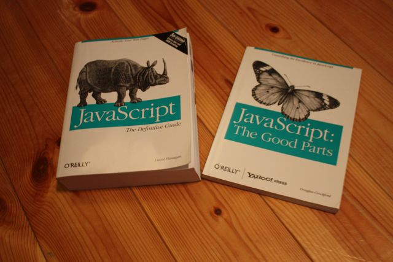
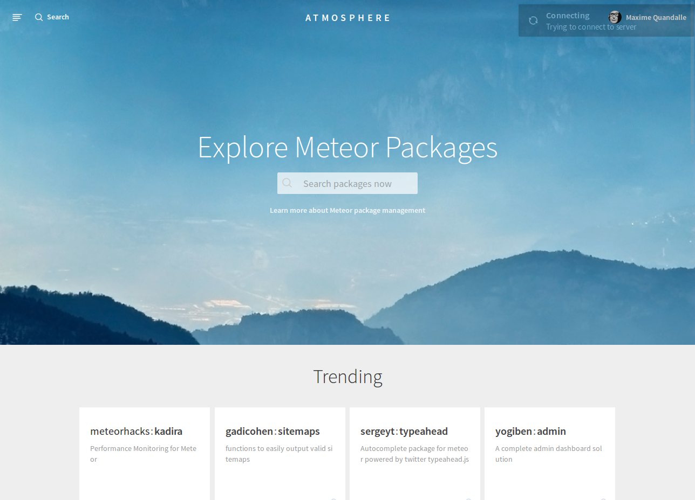

# Les paquets

Pour avoir du succès, un *framework* - ou plus généralement une *plateforme* - doit réussir à générer un écosystème construit au dessus de lui. Ainsi les succès d'iOS et d'Android sont indissociables de celui des applications mobiles, et le succès de Wordpress indissociable des milliers de plugins disponibles pour l'agrémenter. La gestion des paquets (*packages* en anglais) est donc une problématique majeure pour un framework web comme Meteor ; et fort heureusement le système proposé est particulièrement bien conçu et largement mis à profit par une communauté enthousiaste.

Dans ce chapitre nous allons apprendre à ajouter et supprimer des paquets à votre application, puis nous verrons plus en détail les fonctionnalités offertes par certains paquets en particulier et les décisions de conception sous-jacentes au système de paquet de Meteor.

## Présentation du système de paquets

Les packages sont des briques élémentaires apportant des fonctionnalités à une application Meteor. En fait, toutes les fonctionnalités de Meteor sont implémentés dans des packages. Par exemple l'objet `Session` est implémenté dans un package `session`. Les packages peuvent dépendre d'autres packages. Comme nous l'avons vu au chapitre précédent le package `session` dépend du package `tracker` qui permet de construire une source réactive.

Pour ajouter un package utilisez la commande :

```bash
$ meteor add package-name
```

et pour le supprimer utilisez la commande :

```bash
$ meteor remove package-name
```

Ces deux commandes se contentent simplement d'éditer un fichier texte contenant le nom des packages utilisés par l'application. Ce fichier `packages` se trouve dans le répertoire caché `.meteor` situé à la racine de votre projet. Vous pouvez regarder son contenu :

```bash
$ cat .meteor/packages
# Meteor packages used by this project, one per line.
#
# 'meteor add' and 'meteor remove' will edit this file for you,
# but you can also edit it by hand.

meteor-platform
autopublish
insecure
```

Comme l'indique le commentaire en tête, il est tout à fait possible d'éditer ce fichier manuellement sans passer par les commandes `meteor add` et `meteor remove`. Par ailleurs, si vous utilisez un logiciel de gestion de versions (vous devriez !) ce fichier doit être suivi afin que les autres personnes qui téléchargent votre application puissent en connaître la liste des dépendances.P

Pour connaitre la liste des noms et des versions des paquets utilisés par une application vous pouvez utiliser la commande `list` :

```bash
$ meteor list
autopublish      1.0.0  Publish the entire database to all clients
insecure         1.0.0  Allow all database writes by default
meteor-platform  1.1.1  Include a standard set of Meteor packages in your app
```

Par défaut notre application utilise trois paquets `meteor-platform`, `autopublish` et `insecure`. En général, une application en production ne devrait pas utiliser `autopublish` et `insecure`. Ces deux paquets sont utilisés par défaut uniquement pour accélérer le prototypage d'une application au début de son développement. Nous verrons comment nous en passer dans les prochains chapitres.

`meteor-platform` est quant à lui un groupe de paquets par défaut. L'inclure dans une application équivaut à inclure la liste de paquet suivante :

```
meteor
webapp
logging
tracker
session
ddp
mongo
blaze
spacebars
templating
check
underscore
jquery
random
ejson
reload
autoupdate
fastclick
mobile-status-bar
```

Il est donc tout à fait possible de remplacer `meteor-platform` par la liste ci-dessus, ce qui permet éventuellement de la personnaliser. Vous pouvez par exemple supprimer le package `session` si vous n'utilisez pas les variables de session. Ou remplacer `spacebars` par une autre syntaxe de template. Néanmoins il est préférable de garder cette liste inchangée dans un premier temps. Ces packages sont conçus pour fonctionner ensemble et modifier cette liste pourrait introduire des bugs.

De cette section retenez donc les trois commandes suivantes: `add` pour ajouter un paquet, `remove` pour en retirer un, et `list` pour lister les paquets utilisés par l'application. Rien de bien sorcier...

## Exemples

Cette section présente deux paquets permettant d’illustrer ce que veut dire « rajouter des fonctionnalités à votre application ».

### Une API HTTP avec le package `http`

Votre application a parfois besoin de communiquer avec des serveurs tiers via l'utilisation d'une requête HTTP. Sans Meteor, côté serveur avec nodejs vous écririez quelque chose comme cela :

```javascript
var http = require('http');

var options = {
  host: 'httpbin.org',
  port: 80,
  path: 'robots.txt'
};

http.get(options, function(resp){
  resp.on('data', function(chunk){
    // faire quelque chose avec `chunk`
  });
}).on("error", function(e){
  console.log('Oops');
});
```

Et côté client, vous utiliseriez une requête AJAX, comme suit :

```javascript
var xmlhttp = new XMLHttpRequest();
xmlhttp.onreadystatechange = function() {
  if (xmlhttp.readyState == 4 ) {
    if(xmlhttp.status == 200) {
      // faire quelque chose avec `xmlhttp.responseText`
    }
    else {
      console.log('Oops');
    }
  }
}

xmlhttp.open("GET", "http://httpbin.org/robots.txt", true);
xmlhttp.send();
```

Deux fragments de codes radicalement différents pour exprimer une idée identique (faire une requête HTTP et lire sa réponse) mais sur deux environnement différents (le client et le serveur). Notez qu'il faudrait en plus supporter des versions plus anciennes d'Internet Explorer, et améliorer la gestion des erreurs. Bref un cas d'usage parfait pour un paquet meteor ! Comme nous l'avons vu il vous suffit d’exécuter la commande suivante pour ajouter le paquet `http` :

```bash
$ meteor add http
```

Dans l’esprit d'un JavaScript isomorphique prôné par Meteor, vous avez maintenant accès à un objet global `HTTP` qui s'utilise avec la même API quelque soit l'environnement. Pour reprendre l'exemple ci-dessus, il nous suffira simplement d'utiliser :

```javascript
HTTP.get("http://httpbin.org/robots.txt", function (err, res) {
  // faire quelque chose avec `err` et `res`
});
```

Il est également possible d'utiliser `HTTP.post`, `HTTP.put`, et `HTTP.del`. Le paquet supporte toutes les options nécessaires pour personnaliser les en-tête de la requête ou pour s'authentifier au serveur. Par ailleurs l'objet réponse est normalisé et contient systématiquement le statut, le contenu, les en-têtes , et éventuellement un objet JSON parsé à partir du contenu. Pour plus de détails sur l'utilisation de ce paquet, [consultez la documentation](http://docs.meteor.com/#http).

La majorité des paquets fonctionnement sur le même modèle que le paquet `http`. On dit qu'ils « exportent » un objet global qui expose une API publique. C'est le cas par exemple des objets `Tracker` et `Session` que nous avons déjà rencontrés.

Mais il existe également un second type de paquets qui va venir changer la manière de « construire » l'application, c'est le cas par exemple du paquet `coffeescript`.

### Du café pour oublier JavaScript

Dans le premier chapitre d'introduction, nous avions vu que l'un des arguments en faveur de Meteor était l'utilisation d'un même langage sur le client et sur le serveur : JavaScript.

Pour qui prend le temps de l'étudier, JavaScript est incontestablement un bon langage de programmation. La machine virtuelle V8 développé par Google pour son navigateur Google Chrome, et utilisé par Node.js, est plus performante que bien d'autres « langages web » (PHP, Ruby, Python...). Mais le JavaScript souffre aussi d'erreurs de conception qui peuvent être source de bugs. Voyez par exemple les tests d'égalité suivants :

```javascript
'' == '0'           // false
0 == ''             // true
0 == '0'            // true

false == 'false'    // false
false == '0'        // true

false == undefined  // false
false == null       // false
null == undefined   // true

' \t\r\n ' == 0     // true
```

Difficile de s'y retrouver !

Les développeurs JavaScript ont appris à éviter les « mauvaise parties » du langage et à n'utiliser que les « bonnes parties ». En l’occurrence pour l’exemple ci dessus, il ne faut jamais utiliser l'opérateur `==` car il effectue des conversions de type à la volée difficilement prédictible dans l'esprit du développeur, à la place il faut utiliser l'opérateur `===` fait la comparaison attendue et retourne `false` dans tous les cas ci-dessus.



D'autres développeurs choisissent d'utiliser des alternatives à JavaScript comme `Dart` développé par Google, ou `TypeScript` développé par Microsoft. Ces langages sont compilés vers du code JavaScript et le compilateur s'arrange en général pour n'en utiliser que les « bonnes parties », par exemple en empêchant l'utilisation de l’opérateur `==`.

L’alternative la plus populaire à JavaScript s'appelle *CoffeeScript*, il se définit simplement comme du « sucre syntaxique » pour JavaScript.

L'utilisation de coffeescript avec Meteor est d'une simplicité enfantine :

```bash
$ meteor add coffeescript
```

Et c'est tout ! Vous pouvez maintenant créer un fichier `myapp.coffee` et développer en CoffeeScript :

```coffeescript
Tracker.autorun ->
  nbPlayers = Session.get('seleted_players')?.length
  console.log "#{nbPlayers} joueur(s) sélectionné(s)"
```

Le code ci-dessus affiche réactivement un message dans la console contenant le nombre de joueurs sélectionnés dans l'application leaderboard. Il utilise plusieurs fonctionnalités de CoffeeScript comme la définition des blocs par l'indentation, l'utilisation de la flèche (`->`) pour définir une fonction, l'accesseur existentiel (`?.`), ou encore l'interpolation dans la chaine de caractères.

Une liste complète des fonctionnalités offertes par CoffeeScript est lisible dans la [documentation du projet](http://coffeescript.org).

L'une des critiques opposée à l'utilisation d'un langage alternatif à JavaScript est que le code écrit par le développeur diffère du code exécuté. Ce point est largement atténué par l'utilisation automatique des « source maps » comme nous le verrons dans l'excursus consacré aux outils de développement.

Il existe d'autres paquets construits sur le même modèle que le plugin `coffeescript` comme les pré-processeurs CSS `less` et `stylus`, ou encore le paquet `spacebars` qui nous permet d'écrire des templates avec un syntaxe proche du HTML et qui les compile dans une structure abstraite basée sur JavaScript.

## Genèse et motivations

### Encore un nouveau système de paquets

Meteor ne réinvente-t-il pas la roue une n-ième fois en créant son propre système de paquets au lieu d'utiliser l'une des déjà trop nombreuses alternatives ? Probablement que si, au moins dans une certaine mesure.

À ce propos l'une des critiques revenant régulièrement concerne l'utilisation d'un système maison au lieu d'NPM (pour Node Package Manager) le système largement utilisé par la communauté Node.js. En fait, NPM n'est pas une solution acceptable, précisément parce qu'il est la système de paquets de Node.js, qui n'est que l'une des plateformes supportées par Meteor (le serveur). Le système de paquets de Meteor doit pouvoir spécifier du code différent pour différentes plateformes. Soit par exemple pour implémenter la même API avec une implémentation qui diffère selon les environnements (c'est le cas du paquet `http` que nous avons vu plus haut), soit encore pour pouvoir faire fonctionner un client et un serveur ensemble. Un paquet de création de formulaires pourra ainsi fournir des méthodes pour générer une interface utilisateur côté client, et des méthodes pour la validation des données côté serveur, le tout fonctionnant en harmonie.

La création d'un nouveau système de paquets fut donc motivée par le besoin de cibler différentes plateformes à partir d'un unique code source. Meteor utilise le néologisme « unipackage », ou unipaquet en français pour nommer ce concept.

Quid alors du sixième principe de Meteor :

> Enlacer écosystème. Meteor est open source et s'intègre avec les outils open source existants, plutôt que de s'y substituer.

Ce principe n'a fort heureusement pas été oublié lors de la conception du système de paquets. En effet un paquet Meteor peut requérir des dépendances téléchargées depuis des systèmes de paquets tiers. Il est ainsi possible d'utiliser une dépendance depuis NPM côté serveur, une dépendance de bower côté client, ou encore une dépendance téléchargée depuis le dépôt de cordova pour les applications mobiles. Cette possibilité garantie la possibilité d'utiliser les fonctionnalité caractéristiques de la plateforme, les paquets NPM pouvant par exemple lancer des nouveaux processus sur le serveur, et les paquets cordova pouvant accéder aux capteurs du téléphone.

Le système de Meteor permet donc de distribuer des paquets fonctionnant sur le client, sur le serveur, sur un mobile, tout en utilisant les possibilités offertes par la plateforme visée.

### Résolution de conflits

Comme tout système de paquets qui se respecte, le système développé par Meteor permet aux paquets de définir une liste de dépendances à d'autres paquets. Bien que l'architecture interne du framework permette théoriquement de charger plusieurs version d'une même librairie et de n'exposer à chaque paquet que la version qu'il a demandé, Meteor a choisi de ne charger qu'une seule version pour un paquet donné. Le chargement d'une même librairie en plusieurs exemplaires de versions différentes pose en effet un certain nombre de problèmes non triviaux : augmentation du volume de code envoyé au client, incertitude sur la version utilisée, effets de bords divers, etc.

Pour choisir la version à utiliser le système de paquet exécute une fonction de résolution de contraintes prenant en entrée la liste des dépendances de chaque paquet. Ce solveur est conservateur, si un paquet ou une application dépend de jquery en version `1.5` et qu'une nouvelle version `1.6` est disponible, le solveur n'utilisera pas la nouvelle version considérant que si le développeur du paquet ou de l'application en question a explicité le numéro de version à inclure il faut respecter cette contrainte. Le problème se pose lorsqu'un paquet requiert jquery `1.5`, et qu'un autre requiert jquery `1.6`. Puisque Meteor ne doit inclure qu'une seule version de jquery il doit choisir laquelle parmi les deux versions demandée. Dans ce cas il choisira la version `1.6` car cette nouvelle version inclut probablement des fonctionnalités non présentes dans la version précédente.

Le solveur de contraintes suppose que les paquets suivent la [gestion sémantique de version](http://semver.org/lang/fr/). Cette gestion impose d'une part l'utilisation d'une numérotation à trois nombres `MAJEURE.MINEURE.CORRECTIF`, et impose d'autre part de respecter la compatibilité ascendante lors de l’incrémentation du numéro de correctif ou de version mineure. Cela veut dire qu'un code fonctionnant avec une dépendance en version `1.5` doit fonctionner de manière identique avec la version `1.6` (qui peut bien sur inclure des nouvelles fonctionnalités ou des améliorations de performance). Tout changement incompatible de l'API publique doit entrainer une incrémentation du numéro de version majeure. En conséquence si un paquet `A` requiert jquery en version `1.6` et qu'un autre paquet `B` requiert jquery en version `2.0`, le solveur ne saura pas quelle version choisir et produira une exception. En général ce cas ne devrait pas se produire car il existe probablement une version de `B` plus ancienne s'appuyant sur jquery `1.x` et c'est cette version que choisira le solveur.

Enfin vous pouvez consulter la liste complète des paquets et de leur version utilisés par votre application dans le fichier `.meteor/versions` :

```bash
$ head .meteor/versions
application-configuration@1.0.3
autopublish@1.0.1
autoupdate@1.1.2
base64@1.0.1
binary-heap@1.0.1
blaze-tools@1.0.1
blaze@2.0.2
boilerplate-generator@1.0.1
callback-hook@1.0.1
check@1.0.2
```

### Conventions de nommage

Il existe deux types paquets publics : ceux maintenus par MDG (les paquets « officiels »), et ceux maintenus par des membres de la communauté (les paquets « communautaires »).

Les paquets officiels ont un nom simple, non préfixé, comme `appcache`, `coffeescript`, `jquery`, ou encore `markdown`. La liste complète des paquets officiels est visible avec la commande :

```bash
@TODO quelle commande ?
```

Les paquets communautaires sont quant à eux préfixés par le nom de leur mainteneur, par exemple le paquet `iron:router` est maintenu par `iron`. L’intérêt de cette préfixation est double. Elle permet d'une part d'éviter les collisions de nom et le « squattage » des noms communs, dans le cas ci-dessus, tout le monde peut créer son propre paquet `monnom:router` sans créer de collision. Elle permet d'autre part de créditer les auteurs pour leur travail de développement et de support du paquet concerné.

La recherche de paquet peut s'effectuer directement en ligne de commande avec `meteor search <expression>` ou expression peut être une chaine simple ou plus généralement une expression régulière :

```bash
$ meteor search router
Found the following packages:
ageo:router                     Iron router with IE9 support
cmather:iron-router             Routing specifically designed for Meteor
fuatsengul:iron-router-auth     Fixed version
iron:router                     Routing specifically designed for Meteor
luma:router                     Database driven routes and utilities for Iron...
martino:iron-router-i18n        Iron router support for i18n routing prefix
matheus90:mobi-router           Simple router made for meteor apps designed s...
mrt:carbon-router               CarbonRouter - An alternative, lightweight, m...
...

To get more information on a specific item, use meteor show.
```

Mais l'utilitaire en ligne de commande n'est probablement pas l'outil le plus adapté à la recherche et à la découverte de nouveaux paquets.

## Atmosphere, le dépôt des paquets publics

Atmosphère est un projet développé par [Percolate Studio](http://www.percolatestudio.com/) dont l'objectif initial était le support des paquets communautaire à l'heure ou Meteor ne le permettait pas encore. Depuis Atmosphère a fusionner avec le dépôt officiel et propose maintenant une interface visuelle pour la recherche et la découverte des paquets.



Le site (qui est lui même une application Meteor) est accessible à l’adresse : <https://atmospherejs.com>. Il est relativement simple à prendre en main. Il inclut un système de notation dit « atmosphere ranking » basé sur un certain nombre de critères tels que le nombre de téléchargement du paquet ou encore le nombre d' « étoiles » que les utilisateurs peuvent lui accorder. Vous pouvez vous y connecter avec vote compte développeur Meteor.

> Notez par ailleurs qu’atmosphère utilise l'API publique du dépôt officiel des paquets. Cela veut dire que si le cœur vous en dit, vous pouvez créer une interface alternative, par exemple pour visualiser les choses d'une autre manière, et vous aurez accès exactement aux même données qu’atmosphère.

