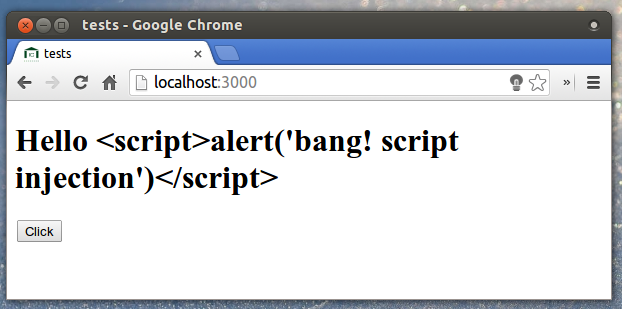

# Excursus: Sécurité

Est-il besoin d'insister sur l'importance de la sécurité en informatique ? Nous avons les données de nos utilisateurs  Meteor est insecure par défaut. Cet état est en partie due à la présence du package `insecure` qui permet un prototypage rapide, mais qu'il convient de retirer avant de déployer votre application, ce que nous feront dans ce chapitre.

Ce chapitre concentre l'intégralité des éléments relatif à la sécurité de votre d'une application Meteor. Il est organisé en deux parties, la première expose les choix d’architecture et les principes généraux formant un modèle théorique de sécurisation. La seconde  constitue une mise en pratique de ces principes, nous verrons quelles sont les différentes attaques possible et comment s'en prémunir.

## Principes de conception

S'il ne devait y avoir qu'un seul principe de sécurité à retenir, ce serait celui-ci : ne faire confiance à personne d'autre qu'à soit même. Un principe général valable pour toutes les applications distribuées. Dans le cas particulier d'une application client serveur, nous transcrivons ainsi : le serveur ne doit jamais faire confiance au client. Ce dernier peut tout à fait modifier le code qu'il exécute, soit facilement avec les outils de débogage du navigateur, mais plus généralement en « fabriquant » ses propres requêtes à partir de rien.

Par exemple, si votre application web propose un formulaire contenant le formulaire suivant :

```html
<form method="post">
  <select name="mark">
    <option>A</option>
    <option>B</option>
    <option>C</option>
  </select>
</form>
```

Ce formulaire contient un unique champ `mark` qui peut prendre uniquement trois valeur possible : `A`, `B`, ou `C`. La valeur choisie est transmise au serveur via une requête `HTTP POST`. Mais un client malveillant peut tout à fait construire “manuellement” une requête HTTP dont le champ `mark` possède une valeur différente de celle proposées par le formulaire. Le serveur devra donc systématiquement vérifier (“sanitize”) l'entrée du client et ne pas supposer que la valeur est forcement l'une des trois proposer par le serveur.

L'application de ce principe général est facilité par certaines décisions architecturales de Meteor. En particulier la stricte séparation du code de l'applciation d'une part, et des données d'autre part. Comme présenté au chapitre précédent le code de l'application est servi via une requête HTTP, tandis que les données sont transmises sur le protocole DDP. Réduit la confusion qui existe naturellement. La proposention par exemple à évaluer du code fourni par DDP

Par ailleurs le protocole DDP offre une connexion persistante, ce qui permet de se prémunir contre une catégorie d'attaque basées sur le vol de session de connexion. Dans une application web basée uniquement sur HTTP, l'authentification doit être Jeton d'authentification transmis via un cookie, il peut être volé.

@TODO Déplacer cela plus bas, quand on parlera de check Match

Enfin Meteor favorise les mon code s'éxecute t-il en particulier. En fait, il n'existe que trois points d'entrée externe sur le serveur :

* Les publications — exécutées quand un client fait une souscription
* Les methodes — exécutées lorsque que le client utilise `Meteor.call`
* Les règles `allow` et `deny` — exécutées quand un client effectue une opération sur une collection

## Attaques et antidotes

### Règles d'autorisation et d'interdiction sur les données

code et données séparés

DDP, pas de eval

Raisonnement clair sur les client/serveur

Allow, Methode, publish

Connection authentifiée
vs cookie jeton de connection, pas besoin de réauthentifier
CFR attaques


Le serveur est digne de confiance, le client ne l'est pas

attaques

XSS

| Caractère | Substitut |
| :--------:|:---------:|
| <         |           |
| >         |           |
| '         |           |
| "         |           |
| `         |           |
| &         |           |


Imaginons un template possédant le symbole `{{titlePage}}` associé à l'helper suivant:

```javascript
Template.tplName.helpers({
  titlePage: '<h1>Leaderboard</h1>'
});
```

L'effet désiré étant bien entendu d'afficher une balise `<h1>` contenant le titre « Leaderboard ». Ce n'est toutefois pas le résultat obtenu. En effet les balises `<h1>` et `</h1>` s'affichent à l'écran comme du texte et ne sont pas interprétées comme du HTML.



Ce comportement est une protection contre les attaques [XSS](https://fr.wikipedia.org/wiki/Cross-site_scripting) qui consistent à injecter du code non désiré dans la page de vos visiteurs. Nous détaillerons cette attaque et les pratiques pour s'en prémunir dans le chapitre dédié à la sécurité.

Dans le cas présent, la solution au problème consiste simplement à déplacer les balises `<h1></h1>` dans le template en laissant le texte vidé du code HTML dans l'helper.

Il peut cependant arriver que vous désiriez afficher une variable contenant du code HTML, dans ce cas vous devez utiliser les triples accolades `{{{helperName}}}` qui indiquent à Meteor de ne pas échapper les caractères spéciaux. Garder à l'esprit que le code ainsi affiché pourrait contenir du JavaScript malveillant qui sera alors executé. Soyez donc sûr de l'origine du code que vous affichez de cette manière.

URL sanitization

eval(String.fromCharCode)

CSS sanitization

content security policy

pas de script inline

Mongo injection

we want to be able to pass objets

check, match

Exception

audit-argument-checks

Javascript Mongo non type strictement

insecure par défault

## check

don't try to filter out "javascript:"

strict checking

XXX Démonstration des problèmes de sécurité liés à la non vérification des paramètres, on pourrait croire que c'est mieux que les injections SQL car on utilise un objet JavaScript et non une chaîne de caratères, mais en fait on peut toujours faire des choses comme {$not: "randomId"} pour accéder aux listes privées des autres utilisateurs.

Meteor propose un paquet nommé `check` qui va grandement simplifier nos vérifications. L'utilisation basique s'effectue comme suit :

```javascript
check(value, Pattern);
```

ou `value` est la valeur à tester et `Pattern` est un modèle décrivant le format désiré. Les primitives `String`, `Number`, `Boolean` ainsi que n'importe constructeur JavaScript (comme `Date`) sont des modèles valides. Les valeurs `undefined` et `null` sont également des primitives valides. Il est aussi possible de valider des objets en utilisant un modèle du type `{key1: pattern1, ..., keyN: patternN}` qui permet de vérifier que la propriété `keyN` de l'objet testé est du type `patternN`. Si l'objet testé contient une entrée qui n'est pas présente dans le modèle, ou bien si le modèle contient une entrée qui n'est pas présente dans l'objet testé, l'objet sera invalide.

[TODO] il faut mettre à jour todos pour utiliser un check.

Le paquet `check` expose également un objet global nommé `Match` qui permet de composer des modèles plus complexes. `Match.Any` permet

Enfin `Match.test`

---


Meteor n'est pas magique, et son utilisation ne rendra pas votre application sécurisée par un tour d'enchantement. Comme pour n'importe quel application, le développeur doit s'assurer que l'applic. Meteor, par l'application de principes architecturaux "opinated", rend simplement "to reason about", en limitant les points d'entrées d'un utilisateur et en fournissant une librairie .
